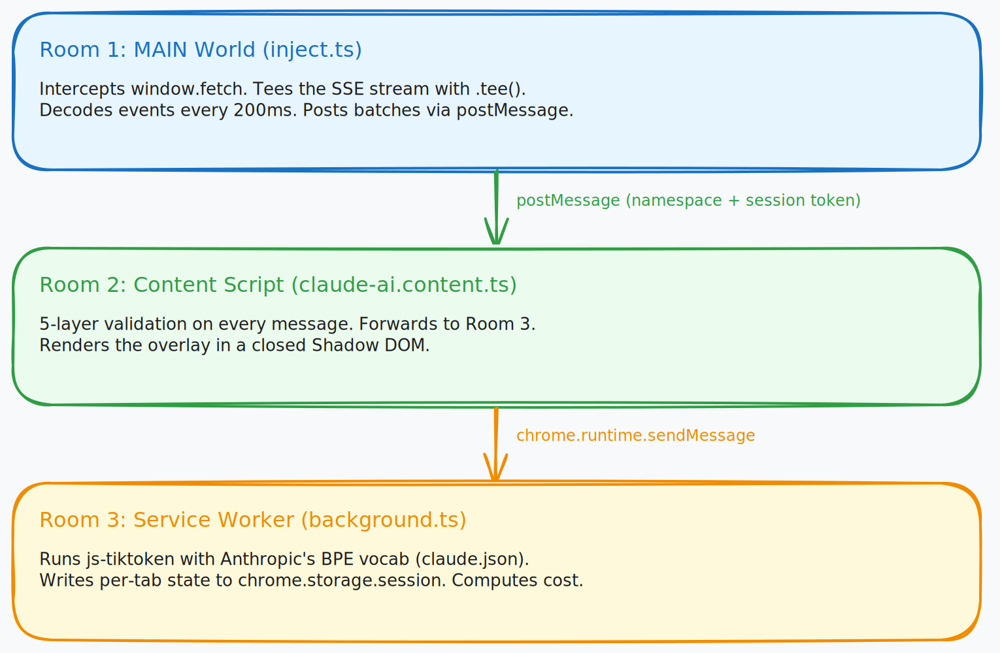

# lco

Anthropic earns more when you burn more tokens. Their docs won't tell you when to start a new chat. Their dashboard won't show you context rot happening in real time.

Saar built lco to fix that. It intercepts Claude's API stream before the UI strips it, counts tokens locally with Anthropic's own BPE vocabulary, and shows you exactly what each message costs.

---

## The overlay

```
┌─ LCO ──────────────────────────────────┐
│ claude-sonnet-4-6                       │
│ 2,847 in / 1,203 out   $0.0267          │
│ ████████████░░░░░░░░░░░░  18% context   │
│ Session: 4 requests · $0.11             │
└─────────────────────────────────────────┘
```

- **Live token counts:** input and output, every 200ms as Claude responds
- **Per-request cost:** BPE counts at stream end, not estimated
- **Context window bar:** how much of the 200K window this conversation has consumed
- **Session totals:** cumulative cost and request count for the tab
- **Message limit bar:** fills amber as you approach Claude's usage cap, pulled from the API directly

---

## Context rot

You open a conversation. Paste in a file. Ask a follow-up, then another. Two hours later you're sending 40,000 tokens of context per message. Claude's giving you worse answers because the useful signal is buried under noise.

Nobody told you this was happening.

```
March invoice: $247.83
April invoice: $189.42
"I thought I was being careful." - every developer, every month
```

Saar tells you.

---

## How it works

Chrome MV3 forces three isolated JavaScript contexts. Saar uses that structure instead of fighting it.



> **Diagram source:** [.github/assets/architecture.excalidraw](.github/assets/architecture.excalidraw)

**Room 1: MAIN World** (`inject.ts`): Intercepts `window.fetch`. Tees the SSE stream so Claude's UI gets an identical copy and never knows we were here. Decodes events and posts batches every 200ms.

**Room 2: Content Script** (`claude-ai.content.ts`): Five-layer validation on every postMessage. Renders the overlay in a closed Shadow DOM.

**Room 3: Service Worker** (`background.ts`): Runs js-tiktoken with Anthropic's BPE vocab. Writes per-tab state to `chrome.storage.session`. Computes cost.

### The fetch intercept

```javascript
// inject.ts: runs inside claude.ai's page context
const originalFetch = window.fetch;

window.fetch = async function (input, init) {
  const url = typeof input === 'string' ? input : input.url;

  if (isCompletionEndpoint(url)) {
    const response = await originalFetch.call(this, input, init);

    if (response.body) {
      // .tee() splits the stream: one copy for Claude's UI, one for lco.
      const [pageStream, monitorStream] = response.body.tee();
      decodeSSEStream(monitorStream, model, prompt);
      return new Response(pageStream, response);
    }
  }

  return originalFetch.call(this, input, init);
};
```

### The 5-layer bridge

Every `postMessage` from Room 1 passes five checks before Room 2 forwards anything:

```typescript
if (event.origin !== 'https://claude.ai') return;  // 1. origin
if (event.source !== window) return;                // 2. source
if (event.data?.namespace !== 'LCO_V1') return;    // 3. namespace
if (event.data.token !== sessionToken) return;      // 4. session token (UUID v4 per load)
if (!isValidBridgeSchema(event.data)) return;       // 5. schema
```

All five must pass or the message is silently dropped. Content scripts process every `postMessage` from the page. Pages can post arbitrary data.

### Token counting

Real-time display uses `chars / 4`: fast, synchronous, close enough for the overlay. At stream end, accurate BPE fires:

```typescript
const [inputCount, outputCount] = await Promise.all([
  countTokens(promptText),
  countTokens(outputTextBuffer),
]);

if (inputCount > 0) summary.inputTokens = inputCount;
if (outputCount > 0) summary.outputTokens = outputCount;
```

The tokenizer uses Anthropic's actual `claude.json` from `@anthropic-ai/tokenizer`. Same vocab Claude uses. Runs in the service worker, off the main thread. Cold start: ~20-40ms. Warm: negligible.

---

## Pricing

| Model | Input | Output | Context |
|-------|-------|--------|---------|
| claude-opus-4-6 | $5 / 1M | $25 / 1M | 200K |
| claude-sonnet-4-6 | $3 / 1M | $15 / 1M | 200K |
| claude-haiku-4-5 | $1 / 1M | $5 / 1M | 200K |

Cost accumulates per tab in `chrome.storage.session` and clears when the browser closes.

---

## Quick start

**Prerequisites:** Node 20+, Bun, Chrome

```bash
git clone https://github.com/OpenCodeIntel/lco
cd lco
bun install && bun run build
```

Load in Chrome:

1. Go to `chrome://extensions`
2. Turn on **Developer mode**
3. **Load unpacked:** select `.output/chrome-mv3`
4. Open `claude.ai`

For hot reload during development:

```bash
bun run dev
```

Load `.output/chrome-mv3` once. Source file changes reload automatically.

See [SETUP.md](SETUP.md) for troubleshooting.

---

## What's next

Claude-only right now. Multi-provider is the point.

- **ChatGPT adapter:** same architecture, different endpoint
- **Coaching nudges:** tell you when to start a new chat, not just how full you are
- **Cross-session history:** token trends over time, not just per-browser-session data that clears on close
- **Firefox**

If your workflow touches more than one AI tool, lco should cover all of them.

---

## Privacy

No servers. No accounts. No telemetry. Your prompts pass through the local BPE tokenizer to produce a count. They're never written to disk. They're never transmitted. `chrome.storage.session` holds counts and costs only.

---

## Contributing

[CONTRIBUTING.md](CONTRIBUTING.md) has what's currently hard to build.
[ARCHITECTURE.md](ARCHITECTURE.md) is the full technical walkthrough.

---

## License

MIT
